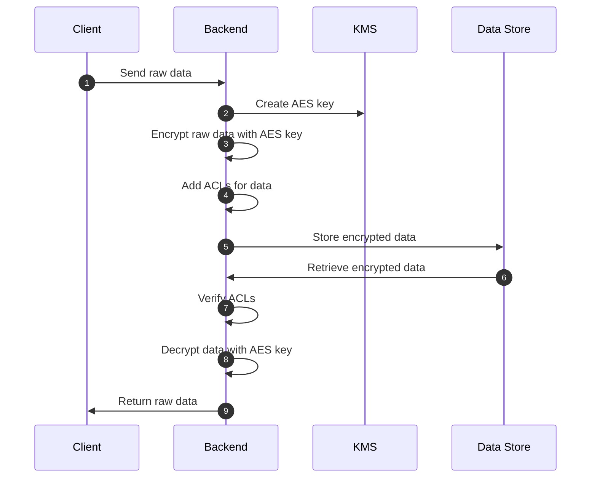
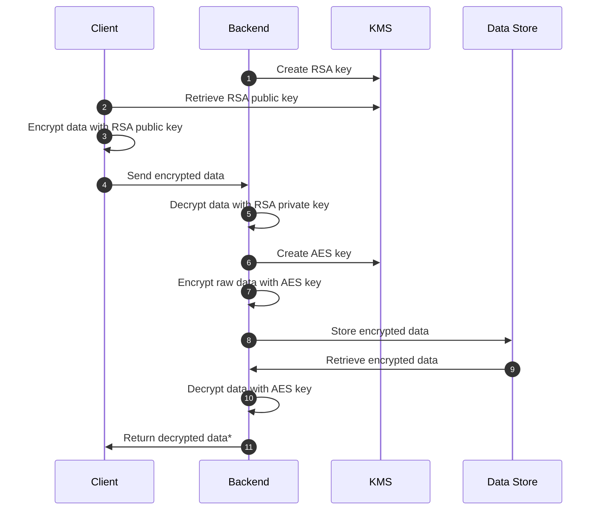
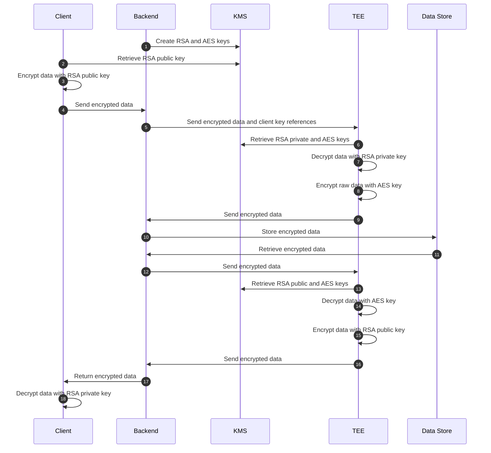

While data exchange on the public internet is protected by robust protocols like [TLS](terminology.md#example-tls-transport-layer-security). Most companies handle sensitive user data internally implemet much loose data security and encryption standards. It's understandable. First, it's very complicated. Second, without shared process and standards, it's very costly to implement and maintain. We build [keyper](https://github.com/jarrid-xyz/keyper/){:target="_blank"} with the goal to simplify and streamline data security and encryption implementations for product and data engineers.

## Direct AES + ACLs Encryption Flow

This is the simplest approach with the least overhead introduced to both the client and backend.

Instead of using [MAC](terminology.md#mac-message-authentication-code), this flow implements identity and access management using existing cloud [IAM](https://en.wikipedia.org/wiki/Identity_management) solutions such as [AWS IAM](https://aws.amazon.com/iam/){:target="_blank"}, [GCP IAM](https://cloud.google.com/security/products/iam){:target="_blank"} etc. as opposed to [data integrity checks](terminology.md#data-integrity-checks). IAM is much more common and widely adopted in most companies' internal data management and security practices and introduce minimal change to existing implementations.

### Pros and Cons

**Pros**

1. **Secure AES Key Management:** The [AES](terminology.md#aes-advanced-encryption-standard) key is managed by the backend applications. Backend applications are generally more secure than the client as they typically have multiple layers of security (network, application, cloud infrastructure, etc.) that can more effectively prevent [AES](terminology.md#aes-advanced-encryption-standard) key leakage.
2. **Minimal Overhead:** This approach introduces the least overhead for both the client and backend, making it efficient and straightforward to implement.

**Cons**

1. **Access to Raw Data:** The backend application has access to the actual [AES]((terminology.md#aes-advanced-encryption-standard)) key and raw data, which means that for highly sensitive data, the backend itself could be a potential point of compromise.
2. **Trust Issues:** Since the backend can see the raw data, it cannot be fully trusted in scenarios where data confidentiality is important.
3. **Misconfiguration Risks:** Both the AES key management and [IAM/ACLs](terminology.md#identity-and-access-management-iam) policies could be misconfigured or mishandled, leading to potential security vulnerabilities.

### Use Cases

Because of the simplicity and low overhead nature of this flow, it's ideal for internal data management to provide extra protection on top of existing IAM and permission policies for added security in case there are misconfigurations or management issues in other layers. For example, if a retention policy is set to infinite but encryption keys are rotated, the data will technically no longer be accessible. Another common example is that even though legally logs are required to be retained for 7-10 years, only certain personnel have permission to decrypt data with the key for legal reasons.

1. **Log Storage:** Encrypt sensitive application logs.
2. **Client Data Storage:** Encrypt client data for client data collected by application.
3. **Data Processing Pipeline:** Encrypt data in cloud based, distributed data processing pipelines.

## Hybrid RSA + AES Encryption Flow

This approach adds overhead to the client compared to the [Direct AES + ACLs Encryption Flow](#direct-aes-acls-encryption-flow), as the client must encrypt the data with the [RSA](terminology.md#rsa-rivest-shamir-adleman) public key. This provides added security by ensuring the client doesn't send raw data to the backend. Additional implementations such as [MAC](terminology.md#mac-message-authentication-code) can be added to ensure data integrity between the client and backend.

It adds overhead to the client comparing to [direct AES + ACLs encryption flow](#direct-aes-acls-encryption-flow) as it has to encrypt the data with [RSA](terminology.md#rsa-rivest-shamir-adleman) public key to provide added security where client doesn't send raw data to backend. It's possible to add additional implementations such as [MAC](terminology.md#mac-message-authentication-code) to ensure between client and backend, data is not tempered.

*Repeat the same process to encrypt/decrypt with RSA key between backend and client

### Pros and Cons

**Pros**

1. **Enhanced Security:** By using [RSA](terminology.md#rsa-rivest-shamir-adleman) for the initial encryption, the data is protected during transmission. The use of [AES](terminology.md#aes-advanced-encryption-standard) for storage ensures efficient encryption.
2. **Separate Key Management:** [RSA](terminology.md#rsa-rivest-shamir-adleman) and [AES](terminology.md#aes-advanced-encryption-standard) keys are managed separately, adding an additional layer of security to reduce the risk of data leakage.
3. **Scalability:** Suitable for systems that require secure data transmission and storage, allowing for scalable key management practices.
4. **Compliance:** Meets regulatory requirements for the secure handling of sensitive data.

**Cons**

1. **Backend Access to Data:** The backend can see the raw data once it is decrypted with the [RSA](terminology.md#rsa-rivest-shamir-adleman) private key, which might not be ideal for highly sensitive data.
2. **Added Complexity and Overhead:** Managing both [RSA](terminology.md#rsa-rivest-shamir-adleman) and [AES](terminology.md#aes-advanced-encryption-standard) keys adds more complexity and performance overhead compared to [Direct AES + ACLs Encryption Flow](#direct-aes-acls-encryption-flow).

### Use Cases

1. **Sensitive Data Transmission:** Securely transmit sensitive data, such as credit card numbers or social security numbers, from the client to the backend.
2. **Secure Form Submission:** Ensure secure transmission of sensitive form data (e.g., online application forms containing personal information) from the client to the backend.

## AES + RSA + TEE Encryption Flow

This approach combines [Hybrid RSA + AES Encryption Flow](#hybrid-rsa--aes-encryption-flow) with [Trusted Execution Environment (TEE)](terminology.md#tee-trusted-execution-environment) to enhance data security. The client encrypts the data with the [RSA](terminology.md#rsa-rivest-shamir-adleman) public key before sending it to the backend, which then sends it to the [TEE](terminology.md#tee-trusted-execution-environment). Within the [TEE](terminology.md#tee-trusted-execution-environment), the data is decrypted using the [RSA](terminology.md#rsa-rivest-shamir-adleman) private key, re-encrypted with an [AES](terminology.md#aes-advanced-encryption-standard) key, and sent to the backend to store in the data store. When the data is needed, the process is reversed, ensuring that sensitive data remains protected throughout the entire workflow.

This flow adds a lot of overhead compared to the [Direct AES + ACLs Encryption Flow](#direct-aes-acls-encryption-flow) and [Hybrid RSA + AES Encryption Flow](#hybrid-rsa--aes-encryption-flow) as it needs to spin up an independent [TEE](terminology.md#tee-trusted-execution-environment) to manage the encryption and decryption. However, the advantage of this approach is that the backend never has access to the data or the AES key. Data is tightly protected throughout the entire data transmission flow.

### Pros and Cons

**Pros**

1. **Enhanced Security:** Combining [RSA](terminology.md#rsa-rivest-shamir-adleman) and [AES](terminology.md#aes-advanced-encryption-standard) with [TEE](terminology.md#tee-trusted-execution-environment) provides a highly secure environment for handling sensitive data.
2. **Data Confidentiality:** The [TEE](terminology.md#tee-trusted-execution-environment) ensures that the decrypted data and AES key are only accessible within the secure enclave, protecting against unauthorized access. Raw data and [AES](terminology.md#aes-advanced-encryption-standard) key is never exposed outside [TEE](terminology.md#tee-trusted-execution-environment) and client.
3. **Integrity and Trust:** The use of [TEE](terminology.md#tee-trusted-execution-environment) guarantees that data processing is performed in a trusted environment, ensuring data integrity and trustworthiness.
4. **Regulatory Compliance:** Meets the most strict regulatory requirements for the secure handling of sensitive data.

**Cons**

1. **Complexity and Cost:** Implementing and managing [TEE](terminology.md#tee-trusted-execution-environment), along with [RSA](terminology.md#rsa-rivest-shamir-adleman) and [AES](terminology.md#aes-advanced-encryption-standard) encryption, introduces significant complexity and cost.
2. **Performance Overhead:** The additional security measures, including [TEE](terminology.md#tee-trusted-execution-environment), introduce significant performance overhead compared to simpler encryption methods.

### Use Cases

1. **Financial Data Protection:** Securely handle and store sensitive financial information, such as credit card details and banking information, ensuring data confidentiality and integrity.
2. **Healthcare Records Management:** Protect sensitive healthcare records, ensuring they are processed and stored in a highly secure and trusted environment.
3. **Regulated Industries:** Suitable for industries with strict regulatory requirements for data protection, such as government and defense, ensuring compliance and data security.
